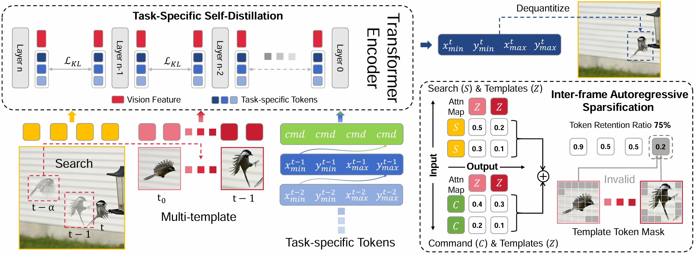

# ICLR2026 | FARTrack

The official PyTorch implementation of our **ICLR 2026**  paper:

**FARTrack: Fast Autoregressive Visual Tracking with High Performance**

GitHub maintainer: [Guijie Wang](https://github.com/wangguijiepedeval)
[[ICLR 2026](https://openreview.net/forum?id=lq7Zfr8kAS)]
[[arxiv](https://arxiv.org/abs/2602.03214v1)]

### :bookmark: Update List:
- [x] Release training code and data.
- [x] Release evaluation code.
- [x] Release checkpoints.

### :bookmark: Checkpoints in Baidu Pan 
[[Baidu Pan](https://pan.baidu.com/s/1m2bPFbLgZ4Q4gBK2YUiynA?pwd=arks)]  passwd: arks

Google Drive:
[FARTrack](https://drive.google.com/file/d/1UJlPtTjDcezYAxd3DLX9OJJqbfhAZTZB/view?usp=sharing)       |     [FARTrackDistill](https://drive.google.com/file/d/1eQxeACtKE9xkPzj2CVCRhSUYIj7SsS4N/view?usp=sharing)     |     [FARTrackSparse](https://drive.google.com/file/d/11iEhd8VQNuAmu9CgXtuJ9CTTz0DlZwDB/view?usp=sharing)     |

### :bookmark:Our FARTrack is accepted by ICLR2026!!!
[[Raw Result](https://drive.google.com/drive/folders/1Dgh4EPxZDpCSHQAba3PX-7_2uGDpdEEi?usp=sharing)] 

We have released the training code for FARTrack and evaluation code into this repository.

|             Variant             | [FARTrack-Tiny](link) | [FARTrack-Nano](link) | [FARTrack-Pico](link) |
| :-----------------------------: | :-----------------------------------------: | :-----------------------------------------: | :-----------------------------------------: |
|          Model Config           |    ViT-Tiny, 224^2 resolution, 15 layers    |    ViT-Tiny, 224^2 resolution, 10 layers    |    ViT-Tiny, 224^2 resolution, 6 layers     |
| GOT-10k (AO / SR 0.5 / SR 0.75) |             70.6 / 81.0 / 63.8              |             69.9 / 81.2 / 61.4              |             62.8 / 72.6 / 50.9              |
| TrackingNet (AUC / Norm P / P)  |             80.7 / 85.6 / 77.5              |             79.1 / 84.5 / 75.6              |             75.6 / 81.3 / 70.5              |
|    LaSOT (AUC / Norm P / P)     |             63.2 / 71.6 / 66.7              |             61.3 / 69.7 / 64.1              |             58.6 / 67.1 / 59.6              |
|  LaSOT_ext (AUC / Norm P / P)   |             45.0 / 54.0 / 49.2              |             43.8 / 53.3 / 47.8              |             41.8 / 50.8 / 44.4              |
|            NFS (AUC)            |                    66.9                     |                    65.1                     |                    62.0                     |
|          UAV123 (AUC)           |                    65.8                     |                    62.6                     |                    63.1                     |

## Highlight



### :bookmark:Brief Introduction

Inference speed and tracking performance are two critical evaluation metrics in the field of visual tracking. However, high-performance trackers often suffer from slow processing speeds, making them impractical for deployment on resource-constrained devices. To alleviate this issue, we propose **FARTrack**, a **F**ast **A**uto-**R**egressive **T**racking framework. Since autoregression emphasizes the temporal nature of the trajectory sequence, it can maintain high performance while achieving efficient execution across various devices. FARTrack introduces **Task-Specific Self-Distillation** and **Inter-frame Autoregressive Sparsification**, designed from the perspectives of **shallow-yet-accurate distillation** and **redundant-to-essential token optimization**, respectively. Task-Specific Self-Distillation achieves model compression by distilling task-specific tokens layer by layer, enhancing the model's inference speed while avoiding suboptimal manual teacher-student layer pairs assignments. Meanwhile, Inter-frame Autoregressive Sparsification sequentially condenses multiple templates, avoiding additional runtime overhead while learning a temporally-global optimal sparsification strategy. FARTrack demonstrates outstanding speed and competitive performance. It delivers an AO of 70.6% on GOT-10k in real-time. Beyond, our fastest model achieves a speed of 343 FPS on the GPU and 121 FPS on the CPU.

### :bookmark:Inference Speed

The inference speed is evaluated with NVIDIA TiTan Xp, Intel(R) Xeon(R) Gold 6230R CPU @ 3.00GHz, and Ascend 310B.

| Variant                                     | GPU (NVIDIA TiTan Xp) | CPU (Intel(R) Xeon(R) Gold 6230R CPU @ 3.00GHz) | NPU (Ascend 310B) |
| ------------------------------------------- | :-------------------: | ----------------------------------------------- | ----------------- |
| [FARTrack-Tiny](link) |          135          | 53                                              | 42                |
| [FARTrack-Nano](link) |          210          | 77                                              | 61                |
| [FARTrack-Pico](link) |          343          | 121                                             | 101               |

## Install the environment

Use the Anaconda (CUDA 12.2)
```
conda env create -f FARTrack_env_cuda122.yaml
```

## Set project paths
Run the following command to set paths for this project
```
python tracking/create_default_local_file.py --workspace_dir . --data_dir ./data --save_dir ./output
```
After running this command, you can also modify paths by editing these two files
```
lib/train/admin/local.py  # paths about training
lib/test/evaluation/local.py  # paths about testing
```

## Data Preparation
Put the tracking datasets in ./data. It should look like this:
   ```
   ${PROJECT_ROOT}
    -- data
        -- lasot
            |-- airplane
            |-- basketball
            |-- bear
            ...
        -- got10k
            |-- test
            |-- train
            |-- val
        -- coco
            |-- annotations
            |-- images
        -- trackingnet
            |-- TRAIN_0
            |-- TRAIN_1
            ...
            |-- TRAIN_11
            |-- TEST
   ```

## Training
Download pre-trained [MAE ViT-Tiny weights](https://drive.google.com/drive/folders/1-i5VNMQRGl-b8IvK-ZwivxzYSG88K8ds?usp=sharing) and put it under `$PROJECT_ROOT$/pretrained_models` (different pretrained models can also be used, see [MAE](https://github.com/facebookresearch/mae) for more details). 

### Frame-level Pretraining

Since sequence-level training requires video input, and the COCO dataset contains only images, traditional training methods were first used to train the model so that it could be fairly compared to other trackers.
```
python tracking/train.py --script fartrack --config fartrack_tiny_224_full --save_dir ./output --mode multiple --nproc_per_node 4 --use_wandb 0
```

Replace `--config` with the desired model config under `experiments/fartrack`. We use [wandb](https://github.com/wandb/client) to record detailed training logs, in case you don't want to use wandb, set `--use_wandb 0`.

### Task-Specific Self-Distillation Training

This phase uses the same datasets and data augmentations as the **frame-level pretraining** phase but introduces additional KL divergence loss $\mathcal{L}_{\mathrm{KL}}$ and trajectory sequence loss $\mathcal{L}_{\mathrm{traj}}=\mathcal{L}_{\mathrm{CE}}+\mathcal{L}_{\mathrm{SIoU}}$ for each layer. This process generates multiple versions of the distilled model, producing models at different layers from a single distillation.

```
python tracking/train.py --script fartrack_distill --config fartrack_distill_224_full --save_dir ./output --mode multiple --nproc_per_node 4 --use_wandb 0
```

### Inter-frame Autoregressive Sparsification Training

To enable sequence-level training, replace 'experience/fartrack_sparse/*.yaml' PRETRAIN_PTH in the yaml configuration file with the path to your pretrained checkpoint, such as './output/fartrack_distill_224_full/checkpoints/train/fartrack_distill/fartrack_distill_224_full/FARTrackDistill_ep0240.pth.tar'.

```
python tracking/train.py --script fartrack_sparse --config fartrack_sparse_224_full --save_dir ./output --mode multiple --nproc_per_node 4 --use_wandb 0
```

## Evaluation

Change the corresponding values of `lib/test/evaluation/local.py` to the actual benchmark saving paths

Some testing examples:
- LaSOT or other off-line evaluated benchmarks (modify `--dataset` correspondingly)
```
python tracking/test.py fartrack_sparse fartrack_sparse_224_full --dataset lasot --threads 16 --num_gpus 4
python tracking/analysis_results.py # need to modify tracker configs and names
```
- GOT10K-test
```
python tracking/test.py fartrack_sparse fartrack_sparse_224_full --dataset got10k_test --threads 16 --num_gpus 4
python lib/test/utils/transform_got10k.py --tracker_name fartrack_sparse --cfg_name fartrack_sparse_224_full
```
- TrackingNet
```
python tracking/test.py fartrack_sparse fartrack_sparse_224_full --dataset trackingnet --threads 16 --num_gpus 4
python lib/test/utils/transform_trackingnet.py --tracker_name fartrack_sparse --cfg_name fartrack_sparse_224_full
```

## Acknowledgement

:heart::heart::heart:Our idea is implemented base on the following projects. We really appreciate their excellent open-source works!

- [SIoU](https://github.com/AlexDotHam/SIoU-loss) [[related paper](https://arxiv.org/abs/2205.12740)]
- [OSTrack](https://github.com/botaoye/OSTrack) [[related paper](https://arxiv.org/abs/2203.11991)]
- [PyTracking](https://github.com/visionml/pytracking) [[related paper](https://arxiv.org/abs/2208.06888)]
- [ARTrack](https://github.com/MIV-XJTU/ARTrack/tree/main) [[related paper](https://openaccess.thecvf.com/content/CVPR2023/papers/Wei_Autoregressive_Visual_Tracking_CVPR_2023_paper.pdf)]
- [ARTrackV2](https://github.com/MIV-XJTU/ARTrack/tree/main) [[related paper](https://arxiv.org/abs/2312.17133)]

:heart::heart::heart:This project is not for commercial use. For commercial use, please contact the author.

:heart::heart::heart:This project is not for commercial use. For commercial use, please contact the author.

:heart::heart::heart:This project is not for commercial use. For commercial use, please contact the author.

## Citation

If any parts of our paper and code help your research, please consider citing us and giving a star to our repository.

```
@inproceedings{
    wang2026fartrack,
    title={{FART}rack: Fast Autoregressive Visual Tracking with High Performance},
    author={Guijie Wang and Tong Lin and Yifan Bai and Anjia Cao and Shiyi Liang and Wangbo Zhao and Xing Wei},
    booktitle={The Fourteenth International Conference on Learning Representations},
    year={2026},
    url={https://openreview.net/forum?id=lq7Zfr8kAS}
}
```

## Contact

If you have any questions or concerns, feel free to open issues.

